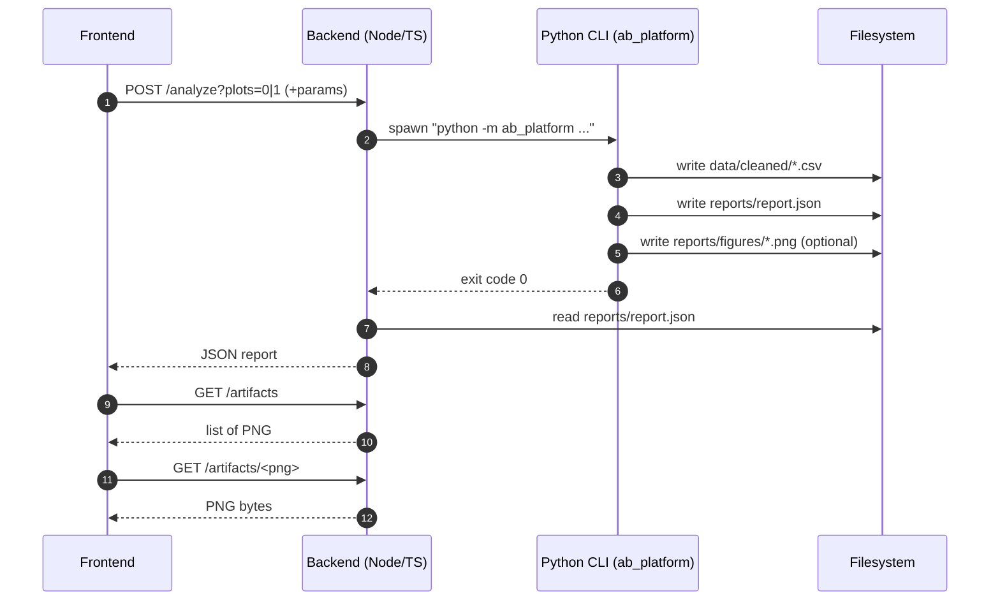

# Архитектура A/B Tests Mini‑Platform

Платформа обеспечивает **воспроизводимый** анализ A/B‑эксперимента от сырого CSV до артефактов (cleaned data + отчёт + графики) и предоставляет доступ через API и UI.

Связанные решения:
- ADR‑0001: SRM и `expected_split`
- ADR‑0002: Balance gating по effect size

---

## Компоненты

### Python пайплайн (`src/ab_platform/`)
- ingest: чтение CSV
- validate/clean: приведение типов, `converted`→0/1, дедупликация по `user id`, проверки качества
- design checks: SRM + balance
- stats: тесты, CI, bootstrap, MDE/мощность, корректировка p‑values
- report: `reports/report.json` + (опционально) PNG в `reports/figures/`

### Backend API (`backend/`)
- `POST /analyze` запускает Python CLI и возвращает JSON отчёт
- `GET /artifacts`/`GET /artifacts/:name` раздают PNG

### Frontend UI (`frontend/`)
- читает JSON отчёт из `/analyze`
- подгружает PNG из `/artifacts/*`
- отображает ключевые блоки: качество данных, SRM, balance, тесты, CI, MDE, рекомендация

---

## Поток данных

```mermaid
flowchart LR
  A[data/raw/marketing_AB.csv] -->|read| B[load & validate schema]
  B --> C[clean: types, converted->0/1, dedupe by user id]
  C --> D[data/cleaned/marketing_AB_clean.csv]
  C --> E[design checks]
  E --> E1[SRM chi-square<br/>expected_split or skipped]
  E --> E2[balance checks<br/>KS/chi2 + effect sizes]
  C --> F[stats]
  F --> F1[z-test / chi2 + CI]
  F --> F2[bootstrap CI (uplift)]
  F --> F3[MDE/power]
  F --> G[report assembly]
  G --> H[reports/report.json]
  G --> I[plots -> reports/figures/*.png]
  H --> J[Backend: POST /analyze]
  I --> K[Backend: GET /artifacts/*]
  J --> L[Frontend: render metrics]
  K --> M[Frontend: render images]
```

---

## Последовательность вызова API



---

## Где лежат артефакты

- **Очищенные данные**: `data/cleaned/marketing_AB_clean.csv`
- **Отчёт**: `reports/report.json`
- **Графики**: `reports/figures/*.png`
- **Логи/вывод**:
  - CLI: `--stdout summary|json`
  - Backend: `POST /analyze` возвращает `500` + `details` при падении пайплайна

---

## Контракт воспроизводимости

Параметры запуска фиксируются в `report.json` → `meta`:

- `seed`, `n_boot`, `alpha`, `ci_level`
- `expected_split`, `srm_uniform_tol`
- `balance_smd_threshold`, `balance_cramersv_threshold`
- `min_uplift_abs`
